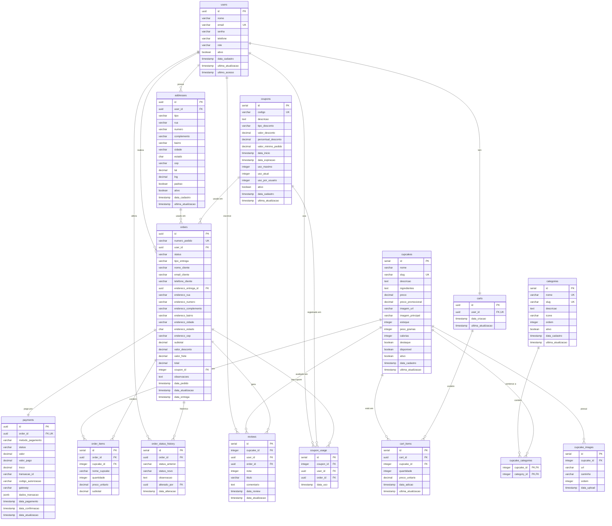

# 📐 Diagrama de Entidade-Relacionamento (ER)

## Visão Geral

Este diagrama representa a estrutura completa do banco de dados do sistema Sweet Cupcakes.

---

## 🎨 Diagrama Visual (Mermaid)



---

## 📊 Diagrama Textual Detalhado

```
┌─────────────────────────────────────────────────────────────────────────────┐
│                             ENTIDADES PRINCIPAIS                             │
└─────────────────────────────────────────────────────────────────────────────┘

┌──────────────────┐
│      USERS       │ ← Usuários do sistema (clientes, admin, staff)
├──────────────────┤
│ PK: id (UUID)    │
│ UK: email        │
│    nome          │
│    senha         │
│    role          │
│    ativo         │
└────────┬─────────┘
         │
         ├─────────────────────────────────────────────────────────┐
         │                                                         │
         ▼ 1:N                                                     ▼ 1:1
┌────────────────────┐                                  ┌──────────────────┐
│     ADDRESSES      │                                  │      CARTS       │
├────────────────────┤                                  ├──────────────────┤
│ PK: id (UUID)      │                                  │ PK: id (UUID)    │
│ FK: user_id        │                                  │ UK: user_id      │
│    tipo            │                                  └────────┬─────────┘
│    rua, numero     │                                           │
│    cidade, estado  │                                           │ 1:N
│    cep             │                                           ▼
│    lat, lng        │                                  ┌──────────────────┐
│    padrao          │                                  │   CART_ITEMS     │
└────────┬───────────┘                                  ├──────────────────┤
         │                                              │ PK: id           │
         │ N:1                                          │ FK: cart_id      │
         ├──────────────────┐                          │ FK: cupcake_id   │
         │                  │                          │    quantidade    │
         ▼                  │                          │    preco_unit    │
┌────────────────────┐      │                          └────────┬─────────┘
│      ORDERS        │      │                                   │
├────────────────────┤      │                                   │ N:1
│ PK: id (UUID)      │      │                                   │
│ UK: numero_pedido  │      │                          ┌────────▼─────────┐
│ FK: user_id        │      │                          │    CUPCAKES      │
│ FK: endereco_id    │◄─────┘                          ├──────────────────┤
│ FK: coupon_id      │                                 │ PK: id           │
│    status          │                                 │ UK: slug         │
│    tipo_entrega    │                                 │    nome          │
│    subtotal        │                                 │    descricao     │
│    valor_desconto  │                                 │    preco         │
│    valor_frete     │                                 │    preco_promo   │
│    total           │                                 │    estoque       │
│    [snapshot data] │                                 │    destaque      │
└────────┬───────────┘                                 │    disponivel    │
         │                                             └────────┬─────────┘
         ├─────────────────┬─────────────────┐                 │
         │ 1:1             │ 1:N             │ 1:N             │
         ▼                 ▼                 ▼                 │
┌──────────────┐  ┌─────────────────┐  ┌──────────────┐       │
│   PAYMENTS   │  │  ORDER_ITEMS    │  │ STATUS_HIST  │       │
├──────────────┤  ├─────────────────┤  ├──────────────┤       │
│ PK: id       │  │ PK: id          │  │ PK: id       │       │
│ UK: order_id │  │ FK: order_id    │  │ FK: order_id │       │
│    metodo    │  │ FK: cupcake_id  │  │    status_ant│       │
│    status    │  │    nome_cupcake │  │    status_new│       │
│    valor     │  │    quantidade   │  │    alterado  │       │
│    troco     │  │    preco_unit   │  └──────────────┘       │
│    gateway   │  │    subtotal     │                         │
└──────────────┘  └─────────┬───────┘                         │
                            │ N:1                             │
                            │                                 │
                            └─────────────────────────────────┘

┌─────────────────────────────────────────────────────────────────────────────┐
│                      CATEGORIAS E RELACIONAMENTOS                            │
└─────────────────────────────────────────────────────────────────────────────┘

┌────────────────┐            ┌─────────────────────┐           ┌──────────────┐
│   CATEGORIES   │            │ CUPCAKE_CATEGORIES  │           │   CUPCAKES   │
├────────────────┤            ├─────────────────────┤           ├──────────────┤
│ PK: id         │◄───────────┤ PK,FK: category_id  │◄──────────┤ PK: id       │
│ UK: nome, slug │     N:N    │ PK,FK: cupcake_id   │    N:N    │ UK: slug     │
│    descricao   │            └─────────────────────┘           │    [...]     │
│    icone       │                                              └──────┬───────┘
│    ordem       │                                                     │
└────────────────┘                                                     │ 1:N
                                                                       ▼
                                                              ┌──────────────────┐
                                                              │ CUPCAKE_IMAGES   │
                                                              ├──────────────────┤
                                                              │ PK: id           │
                                                              │ FK: cupcake_id   │
                                                              │    url           │
                                                              │    ordem         │
                                                              └──────────────────┘

┌─────────────────────────────────────────────────────────────────────────────┐
│                        CUPONS E AVALIAÇÕES                                   │
└─────────────────────────────────────────────────────────────────────────────┘

┌────────────────┐            ┌─────────────────┐
│    COUPONS     │            │  COUPON_USAGE   │
├────────────────┤            ├─────────────────┤
│ PK: id         │◄───────────┤ PK: id          │
│ UK: codigo     │     1:N    │ FK: coupon_id   │
│    tipo        │            │ FK: user_id     │
│    valor/perc  │            │ FK: order_id    │
│    uso_max     │            │    data_uso     │
│    expiracao   │            └─────────────────┘
└────────┬───────┘
         │ 1:N
         │
         ▼
    [ ORDERS ]


┌────────────────────────────────────────────────────┐
│              REVIEWS (Avaliações)                  │
├────────────────────────────────────────────────────┤
│ PK: id                                             │
│ FK: cupcake_id  ──►  CUPCAKES                      │
│ FK: user_id     ──►  USERS                         │
│ FK: order_id    ──►  ORDERS                        │
│ UK: (cupcake_id, user_id, order_id)                │
│    nota (1-5)                                      │
│    titulo                                          │
│    comentario                                      │
└────────────────────────────────────────────────────┘
```

---

## 🔗 Tipos de Relacionamentos

### 1:1 (Um para Um)
- **users ↔ carts**: Cada usuário tem um carrinho
- **orders ↔ payments**: Cada pedido tem um pagamento

### 1:N (Um para Muitos)
- **users → addresses**: Um usuário pode ter vários endereços
- **users → orders**: Um usuário pode ter vários pedidos
- **users → reviews**: Um usuário pode fazer várias avaliações
- **carts → cart_items**: Um carrinho pode ter vários itens
- **orders → order_items**: Um pedido pode ter vários itens
- **orders → order_status_history**: Um pedido tem histórico de status
- **cupcakes → cupcake_images**: Um cupcake pode ter várias imagens
- **cupcakes → cart_items**: Um cupcake pode estar em vários carrinhos
- **cupcakes → order_items**: Um cupcake pode estar em vários pedidos
- **cupcakes → reviews**: Um cupcake pode ter várias avaliações
- **coupons → orders**: Um cupom pode ser usado em vários pedidos
- **coupons → coupon_usage**: Um cupom pode ter vários registros de uso

### N:M (Muitos para Muitos)
- **cupcakes ↔ categories**: Um cupcake pode ter várias categorias e uma categoria pode ter vários cupcakes
  - Implementado através da tabela intermediária `cupcake_categories`

---

## 📋 Cardinalidades Detalhadas

```
USERS (1) ──────< (0..N) ADDRESSES
│
├─ Um usuário pode ter zero ou vários endereços
└─ Um endereço pertence a exatamente um usuário

USERS (1) ──────< (1..1) CARTS
│
├─ Um usuário tem exatamente um carrinho
└─ Um carrinho pertence a exatamente um usuário

USERS (1) ──────< (0..N) ORDERS
│
├─ Um usuário pode ter zero ou vários pedidos
└─ Um pedido pertence a exatamente um usuário

CARTS (1) ──────< (0..N) CART_ITEMS
│
├─ Um carrinho pode ter zero ou vários itens
└─ Um item pertence a exatamente um carrinho

ORDERS (1) ──────< (1..1) PAYMENTS
│
├─ Um pedido tem exatamente um pagamento
└─ Um pagamento pertence a exatamente um pedido

ORDERS (1) ──────< (1..N) ORDER_ITEMS
│
├─ Um pedido tem pelo menos um item (mínimo 1)
└─ Um item pertence a exatamente um pedido

CUPCAKES (0..N) ──────< (0..N) CATEGORIES
│
├─ Um cupcake pode ter zero ou várias categorias
├─ Uma categoria pode ter zero ou vários cupcakes
└─ Relacionamento implementado via CUPCAKE_CATEGORIES

CUPCAKES (1) ──────< (0..N) CUPCAKE_IMAGES
│
├─ Um cupcake pode ter zero ou várias imagens
└─ Uma imagem pertence a exatamente um cupcake

CUPCAKES (1) ──────< (0..N) REVIEWS
│
├─ Um cupcake pode ter zero ou várias avaliações
└─ Uma avaliação pertence a exatamente um cupcake

COUPONS (1) ──────< (0..N) ORDERS
│
├─ Um cupom pode ser usado em zero ou vários pedidos
└─ Um pedido pode usar zero ou um cupom (0..1)
```

---

## 🎯 Constraints Principais

### Chaves Primárias (PK)
- `UUID`: users, addresses, carts, orders, payments
- `SERIAL`: categories, cupcakes, coupons, cart_items, order_items, reviews, etc.

### Chaves Estrangeiras (FK)
Todas as FKs possuem ações de integridade referencial:
- `ON DELETE CASCADE`: Para dados dependentes (itens, imagens)
- `ON DELETE RESTRICT`: Para dados críticos (produtos em pedidos)
- `ON DELETE SET NULL`: Para referências opcionais (endereço, cupom)

### Chaves Únicas (UK)
- `users.email`: Email único por usuário
- `categories.nome`, `categories.slug`: Nomes e slugs únicos
- `cupcakes.slug`: Slugs únicos para URLs
- `coupons.codigo`: Códigos de cupom únicos
- `orders.numero_pedido`: Números de pedido únicos
- `carts.user_id`: Um carrinho por usuário
- `payments.order_id`: Um pagamento por pedido
- `(cart_items.cart_id, cart_items.cupcake_id)`: Um cupcake por carrinho
- `(reviews.cupcake_id, reviews.user_id, reviews.order_id)`: Uma review por cupcake por pedido

### Check Constraints
- Valores monetários sempre >= 0
- Quantidades sempre > 0
- Percentuais entre 0 e 100
- Status e tipos com valores específicos (ENUM-like)
- Preço promocional < preço regular
- Notas de review entre 1 e 5

---

## 🔍 Índices Importantes

### Índices em Chaves Estrangeiras
Todos os FKs possuem índices para otimizar JOINs.

### Índices de Busca
- `users.email`: Login rápido
- `cupcakes.slug`, `categories.slug`: URLs amigáveis
- `coupons.codigo`: Validação de cupons
- `orders.numero_pedido`: Busca de pedidos

### Índices de Filtro
- `users.ativo`, `users.role`: Filtros de usuários
- `cupcakes.destaque`, `cupcakes.disponivel`: Filtros de produtos
- `orders.status`, `orders.tipo_entrega`: Filtros de pedidos
- `payments.status`, `payments.metodo_pagamento`: Filtros de pagamentos

### Índices Compostos
- `coupons(data_inicio, data_expiracao)`: Validação de cupons válidos
- Todos os índices em tabelas de relacionamento N:N

---

## 📈 Views Criadas

### v_cupcakes_completos
```sql
cupcakes
├─ JOIN cupcake_categories → categories
└─ LEFT JOIN reviews
   
Retorna: Cupcakes com categorias agregadas e média de avaliações
```

### v_estatisticas_pedidos
```sql
orders (WHERE status != 'cancelado')
GROUP BY DATE(data_pedido)

Retorna: Estatísticas diárias (total pedidos, valores, ticket médio)
```

---

## 🔄 Triggers Implementados

### 1. update_updated_at_column()
```
Tabelas: users, addresses, categories, cupcakes, coupons, 
         carts, cart_items, orders, payments

Ação: BEFORE UPDATE
Efeito: Atualiza automaticamente campo 'ultima_atualizacao'
```

### 2. log_order_status_change()
```
Tabela: orders

Ação: AFTER UPDATE (quando status muda)
Efeito: Insere registro em order_status_history
```

---

## 💾 Estratégia de Snapshot

Alguns campos armazenam **cópias (snapshots)** de dados para preservar histórico:

### Em ORDERS:
```
nome_cliente, email_cliente, telefone_cliente
└─ Preserva dados do cliente no momento do pedido

endereco_rua, endereco_numero, endereco_complemento, ...
└─ Preserva endereço completo mesmo se usuário alterar/excluir
```

### Em ORDER_ITEMS:
```
nome_cupcake
└─ Preserva nome do produto mesmo se for renomeado

preco_unitario
└─ Preserva preço do momento da compra
```

### Em CART_ITEMS:
```
preco_unitario
└─ Preserva preço no momento da adição ao carrinho
```

**Benefícios**:
- ✅ Integridade histórica
- ✅ Relatórios precisos
- ✅ Dados imutáveis de pedidos finalizados

---

## 🎨 Legenda do Diagrama

```
┌─────────────┐
│   TABELA    │ ← Entidade
├─────────────┤
│ PK: campo   │ ← Chave Primária
│ FK: campo   │ ← Chave Estrangeira
│ UK: campo   │ ← Chave Única
│    campo    │ ← Campo comum
└─────────────┘

  ─────►  Relacionamento 1:N (Um para Muitos)
  ◄─────  Relacionamento N:1 (Muitos para Um)
  ◄────►  Relacionamento N:M (Muitos para Muitos)
```

---

## 📊 Estatísticas do Banco

```
Total de Tabelas: 15
├─ Entidades Principais: 7 (users, cupcakes, orders, etc)
├─ Tabelas de Relacionamento: 2 (cupcake_categories, coupon_usage)
├─ Tabelas de Suporte: 6 (addresses, cart_items, order_items, etc)

Total de Índices: ~50
├─ Primários: 15
├─ Únicos: 10
├─ Foreign Keys: ~20
├─ Performance: ~15

Total de Constraints:
├─ Primary Keys: 15
├─ Foreign Keys: ~20
├─ Unique: 10
├─ Check: ~40

Total de Triggers: 11
├─ Update Timestamp: 9
├─ Log Status Change: 1
├─ Custom: 1
```

---

**Versão**: 1.0  
**Criado em**: 2025  
**Banco**: PostgreSQL 12+  
**Ferramenta de Diagrama**: Mermaid ERD
